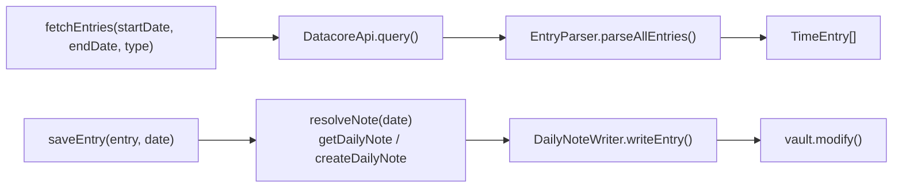
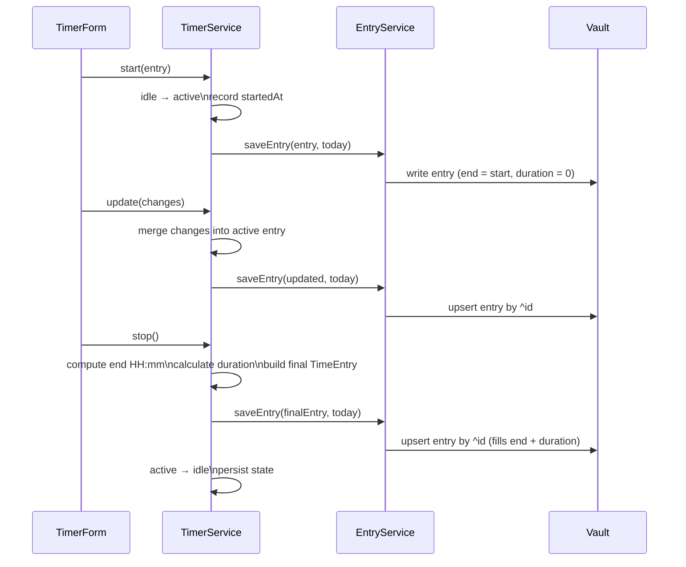

# Services — Implementation Details

## `entry-service.ts`

The single CRUD service for `TimeEntry`. Owns both the read path (DataCore queries) and the
write path (daily note resolution + serialization). Exposed on the plugin instance as
`plugin.entryService` for external plugin access.

Constructor takes `DatacoreApi` and `DailyNoteWriter`. No plugin settings are needed — the
daily note folder is read at query time from `getDailyNoteSettings()` (obsidian-daily-notes-interface),
keeping reads and writes consistent with the Daily Notes plugin configuration.

**Read — `fetchEntries(startDate, endDate, type)`**

Builds a DataCore `@list-item` query scoped to the daily notes folder and date range, filtered
by entry type. Returns parsed `TimeEntry[]`.

| type | query clause |
|---|---|
| `'tracked'` | `and not exists(type)` |
| `'planned'` | `and type = "planned"` |
| `'all'` | *(none)* |

**Write — `saveEntry(entry, date)`**

Resolves the daily note for `date` via `obsidian-daily-notes-interface`, creating it if absent,
then delegates to `DailyNoteWriter.writeEntry`. Acts as an upsert — `DailyNoteWriter` matches
by block ID so the same call handles both initial writes and updates.



---

## `timer-service.ts`

State machine for the active timer. Depends on `EntryService` for all vault writes — it never
touches `DailyNoteWriter` or the vault directly. Timer state is persisted in the plugin's data
file so it survives app restarts.

**`TimerState`** is a discriminated union:

| status | extra fields |
|---|---|
| `'idle'` | *(none)* |
| `'active'` | `startedAt: number` (epoch ms), `entry: TimeEntry` |

The caller constructs the full `TimeEntry` (with ID, start time, `end = start`, `duration = 0`)
before calling `start()`. The service owns only state transitions and vault persistence.

**Methods**

| method | signature | behaviour |
|---|---|---|
| `start` | `(entry: TimeEntry) → Promise<void>` | No-op if already running. Transitions to active, writes entry to vault immediately. |
| `update` | `(changes: Partial<Omit<TimeEntry, 'id' \| 'end' \| 'duration' \| 'type'>>) → Promise<void>` | No-op if idle. Merges changes into active entry (including `start`), upserts to vault. |
| `stop` | `() → Promise<void>` | No-op if idle. Reads current wall clock, computes `end` (HH:mm) and `duration`, upserts entry, transitions to idle. |
| `getElapsed` | `() → number` | Returns `Date.now() - startedAt` when active, `0` when idle. |
| `isRunning` | `() → boolean` | `true` when status is `'active'`. |



`start()` writes to the vault immediately so the block exists even if the app closes before
`stop()` is called. `stop()` upserts the same entry ID with the completed fields.

The service never constructs DOM. The view is never responsible for building entries.

---

## `area-service.ts`

Reads area definitions from the year note via DataCore and exposes them for color-coding and
area selection dropdowns. Exposed on the plugin instance as `plugin.areaService`.

**Constructor** — takes only `DatacoreApi`. 

**Year note format** — list items tagged `#area` in the year note (e.g. `2026.md`):

```markdown
- Work #area [color:: 3b82f6]
- Personal #area [color:: 8b5cf6]
- Learning #area
```

DataCore parses the inline `[color:: hex]` field automatically into `$infields`. `$cleantext`
gives the item text with inline fields stripped but tags retained. The area name is `$cleantext`
with `#area` removed and whitespace normalised. If no `color::` field is present, the fallback
`#94a3b8` is used; values without a leading `#` are normalised automatically.

**DataCore query**

```
@list-item
  and #area
  and childof(@page and $name = "<year>")
```

This selects list items tagged `#area` that are children of a page whose stem matches the year
string (e.g. `"2026"`). DataCore's in-memory index makes this synchronous and fast — no caching
is needed.

**Methods**

| method | signature | behaviour |
|---|---|---|
| `getAreas` | `(year: string) → Area[]` | Queries DataCore for all `#area` items in the year note and returns parsed `Area[]`. |
| `getAreaColors` | `(year: string) → Record<string, string>` | Returns `{ [name]: hex }` built from `getAreas`. |
| `parseAreas` | `(items: MarkdownListItem[]) → Area[]` | Pure mapping step; public for unit testing without a real DataCore instance. |

**Year derivation by caller**

| caller | year source |
|---|---|
| `TimerPanel` | `DateTime.now().year.toString()` — always the current year |
| `Calendar` | `viewState.currentDate.slice(0, 4)` — year of the date being viewed |

Both callers invoke `getAreas` and `getAreaColors` on every render. Because DataCore is a
synchronous in-memory index there is no stale-cache problem and no refresh step is required.
