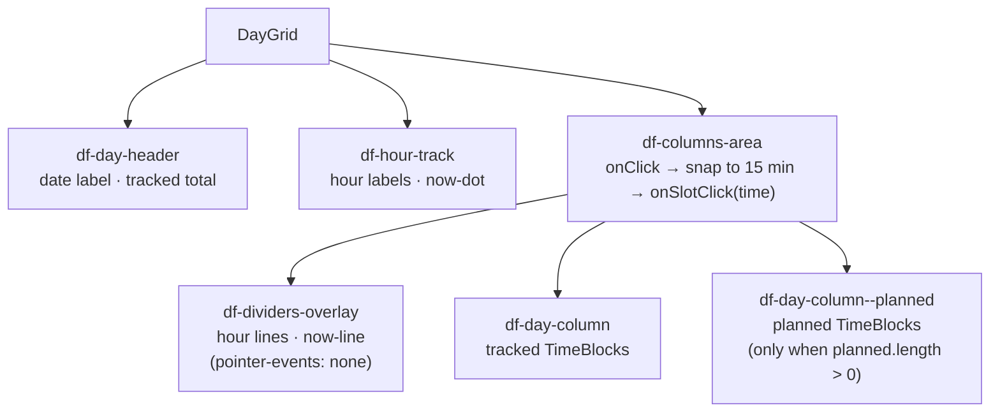
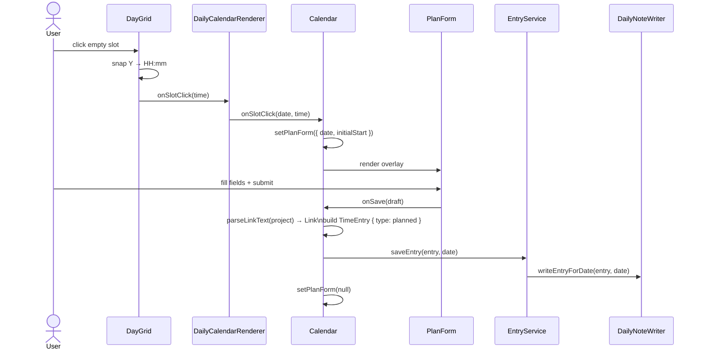

# UI — Implementation Details

## Calendar State Types ([src/ui/calendar.tsx](src/ui/calendar.tsx))

`CalendarViewState` holds `mode` (`daily | weekly | monthly`), `currentDate` (ISO string), and
`options` (`showTracked`). State is kept in memory in `Calendar` and re-initialized on view
open; it is not persisted yet.

## Calendar View Composition

`CalendarView` remains an `ItemView` wrapper that wires services and settings. UI state, plan
creation, and renderer selection live in `Calendar` in [src/ui/calendar.tsx](src/ui/calendar.tsx),
while toolbar controls are in [src/ui/components/calendar-toolbar.tsx](src/ui/components/calendar-toolbar.tsx).

---

## Renderer Subclasses

Each subclass extends `CalendarRenderer` and implements `getDateRange` and `renderGrid`.
`CalendarRendererProps` includes `onSlotClick?: (date, time) => void` which is only populated in
daily mode.

| Class | Date window |
|---|---|
| `DailyCalendarRenderer` | single day |
| `WeeklyCalendarRenderer` | placeholder (`Weekly view — not yet implemented`) |
| `MonthlyCalendarRenderer` | placeholder (`Monthly view — not yet implemented`) |

`CALENDAR_RENDERERS` is a registry object mapping `CalendarMode → CalendarRenderer` subclass.
`useMemo` re-instantiates the renderer only when `mode` changes.

---

## Planned Entries in Daily Mode

Planned entries are only fetched and rendered in **daily mode**. Weekly and monthly renderers
receive tracked entries only. `Calendar` selects the fetch type based on the active mode:

| mode | fetch type |
|---|---|
| `daily` | `'all'` |
| `weekly` / `monthly` | `'tracked'` |

`DayGrid` receives the full `TimeEntry[]` and splits tracked/planned internally.

---

## Shared Components

### DayGrid

Hour-track + columns layout used by daily (and eventually weekly) renderers. `onSlotClick` is
an optional callback; when provided, clicking empty space snaps the Y position to the nearest
15-minute slot. Clicks on a `.df-time-block` are ignored. The header shows the date and total
tracked time for the day. A now-dot and now-line render when viewing today; they update every
minute.

### TimeBlock

Positions a single `TimeEntry` with absolute `top%` and `height%` derived from start time and
duration relative to the visible hour range. Planned entries render with dashed border and 75%
opacity. Blocks use area color schemes for border/background. Tooltips are rendered via a portal
to `document.body` and include task, optional sub-task/description, time span, and badges for
area/project. Sub-task text only appears in the block when the block is tall enough.

---

## Plan Creation Flow

Clicking an empty slot in daily mode opens `PlanForm` as a portal overlay.

`onSlotClick` is only wired in daily mode — `Calendar` passes `undefined` for weekly and
monthly modes so those renderers never trigger it.

### PlanForm

Renders as a portal into `document.body`. Fields: `start` (pre-filled from slot), `end`
(defaults to start + 30 min), `task`, `subTask` (optional), `area` (select), `project`
(optional). Area and task are required; project accepts raw text or `[[wikilink]]` and is parsed
via `parseLinkText` before saving. Entry IDs are generated as a Luxon timestamp string
(`yyyyMMddHHmmssSSS`). Clicking the overlay backdrop cancels the form.

---

## Timer Panel

`TimerPanelView` renders `TimerPanel` (in [src/ui/timer-panel.tsx](src/ui/timer-panel.tsx)) and
bumps a `revision` counter on refresh. `TimerPanel` pulls `TimerState` from `TimerService`, sets
a 1-second interval for the elapsed clock, and uses `revision` to re-fetch today’s tracked
entries. Inputs are disabled while running. Starting a timer writes a tracked entry immediately;
stopping updates end time and duration. The panel includes a task/sub-task row, area/project row
(area options from `AreaService`), optional description, and a list of today’s entries with a
total time badge.
